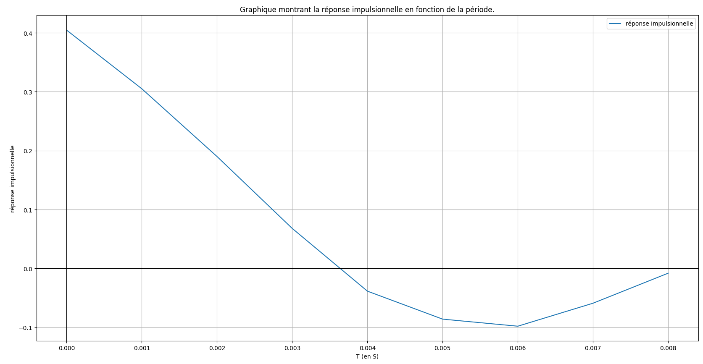
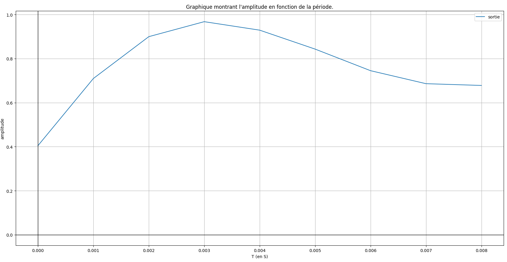
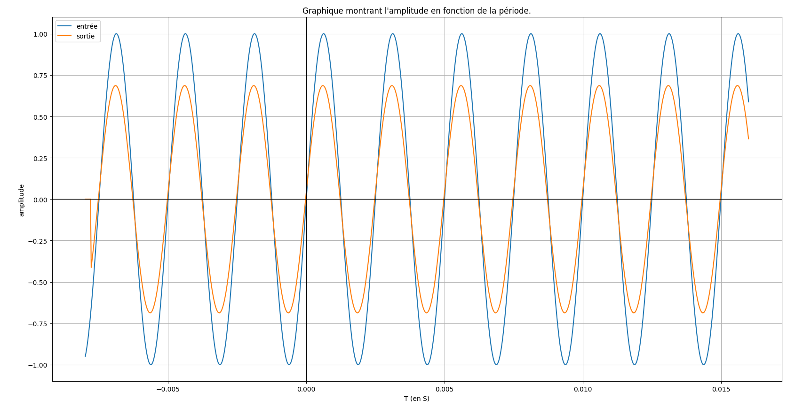
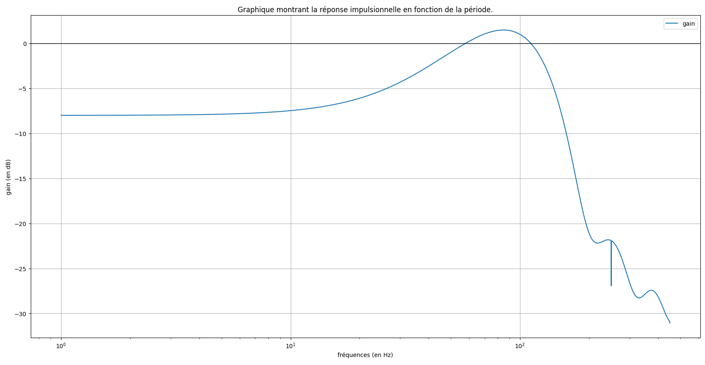

Léonie Bernardino  
Gabin Serrurot  
BTS SNIR

# TP : Etude d'un filtre numérique RIF

## Tracer la réponse impulsionnelle :  

<figure>
    
</figure>

## Justifier l'appelation de RIF :  

Le futur algorithme est qualifié de RIF car nous avons le début d'une sinusoïde amortie, la réponse impulsionnelle va tourner autour et l'axe des abscisses avec des oscillations de plus en plus faibles. Les valeurs vont donc être négligeables 

## Quelle sera la fréquence maximale ?

La fréquence maximale se détermine grâce au théorème de Shannon :  
$$ f_{m} \leq \dfrac{f_{e}}{2} $$
Nous avons donc $$ f_{m} \leq 0.5 kHz $$

## Ecrire cet algorithme sous les deux formes

+ En utilisant la transformée en Z :
$$ T(Z) = 0.4045 + 0.305z^{-1} + 0.19z^{-2} + 0.068z^{-3} - 0.0385z^{-4} - 0.086z^{-5} - 0.098z^{-6} - 0.059^{-7} - 0.008z^{-8} $$
+ En utilisant la relation de récurrence :
$$ T(z) = \dfrac{S(z)}{E(z)} $$
$$ S(z) = E(z)(0.4045 + 0.305z^{-1} + 0.19z^{-2} + 0.068z^{-3} - 0.0385z^{-4} - 0.086z^{-5} - 0.098z^{-6} - 0.059^{-7} - 0.008z^{-8}) $$
$$ S(z) = 0.4045E(z) + 0.305z^{-1}E(z) + 0.19z^{-2}E(z) + 0.068z^{-3}E(z) - 0.0385z^{-4}E(z) - 0.086z^{-5}E(z) $$
$$ - 0.098z^{-6}E(z) - 0.059^{-7}E(z) - 0.008z^{-8}E(z) $$

donc nous obtenons au final
$$ s(n) = 0.4045e(n) + 0.305e(n - 1) + 0.19e(n - 2) + 0.068e(n - 3) - 0.0385e(n - 4) - 0.086e(n - 5) $$
$$ - 0.098e(n - 6) - 0.059e(n - 7) - 0.008e(n - 8) $$

## Justifier de la stabilité de l'algorithme

L'algorithme est stable car la réponse impulsionnelle tend vers 0 en $ +\infty $.

## Tester le sur un indice unitaire, en déduire le type probable de filtre auquel on a affaire

Voici le graphique obtenu :

<figure>
    
</figure>

## Tester le sur quelques sinusoïdes de fréquence inférieur à FM pour tracer un morceau du diagramme de Bode en amplitude de ce filtre

<figure>
    
</figure>

<figure>
    
</figure>
